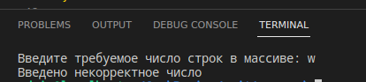
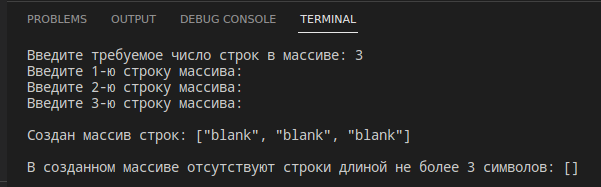
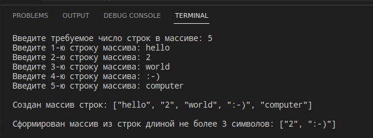
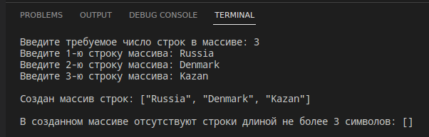

# Проверочная работа по итогу прохождения первого блока обучения на программе "Разработчик".

## Задача
Написать программу, которая из имеющегося массива строк формирует массив из строк, длина которых меньше либо равна 3 символа.
Первоначальный массив можно ввести с клавиатуры, либо задать на старте выполнения алгоритма. 
При решении не рекомендуется пользоваться коллекциями, лучше обойтись исключительно массивами.

    Примеры:
    ["hello", "2", "world", ":-)"] => ["2", ":-)"]
    ["1234", "1567", "-2", "computer science"] => ["-2"]
    ["Russia", "Denmark", "Kazan"] => []

## Решение
Задача решена с применением следующего алгоритма: 
1. Пользователь вводит с клавиатуры количество строк в создаваемом массиве;
2. Производится проверка введённого значения. 
    
    Для этой цели создан метод **_int PromptInt(string message)_**:
    * При положительном результате проверки работа программы продолжается;
    * При отрицательном - прекращается с выводом в терминал сообщения "Введено некорректное число";
3. Пользователь вводит выбранное им ранее количество строк произвольной длины;
4. Проверка вводимой строки производится при помощи метода **_string PromptStr(string message)_**:
    * В случае ввода пустой строки, она заполняется значением *"blank"*
5. После проверки введённые строки добавляются в массив. Ввод, проверка и добавление строк в массив производится в цикле, ограниченном количеством строк;
6. После окончания отработки цикла, в терминал выводится сообщение *"Создан массив строк: <array>"*, для чего задействуется метод **_string PrintArray(string[] arr)_**;
7. Для формирования массива, состоящего из строк длиной не более 3-х символов, используется метод **_string[] FormArray(string[] arr)_**;
8. В терминал выводится сообщение *_"Сформирован массив из строк длиной не более 3 символов: <array>"_*;
9. В случае, когда первоначальный массив не содержит строки, удовлетворяющие условию задачи, выводится сообщение *_"В созданном массиве отсутствуют строки длиной не более 3 символов: []"_*.

## Снимки экрана
1. Некорректный ввод количества строк:

    

2. Ввод пустых строк:

    

3. Ввод корректных значений:

    

4. Первоначальный массив содержит строки длиной более 3-х символов:

    